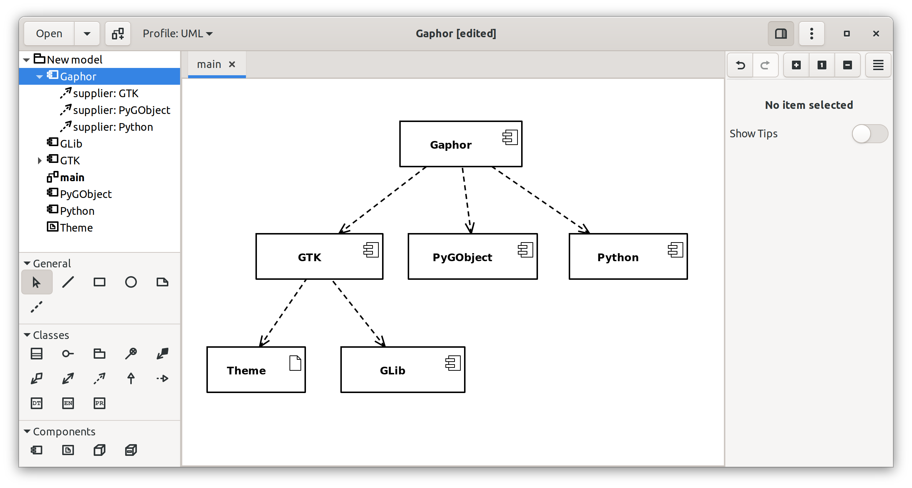
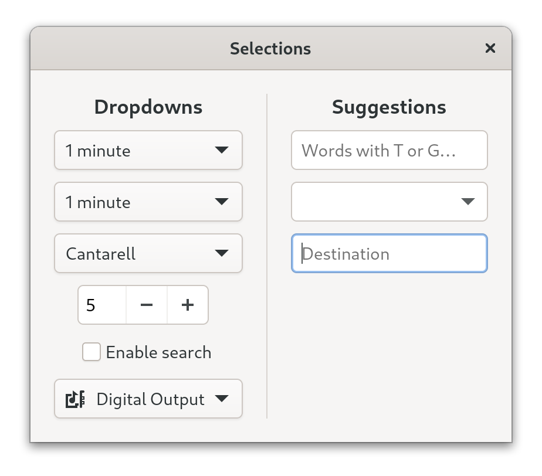
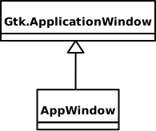
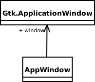
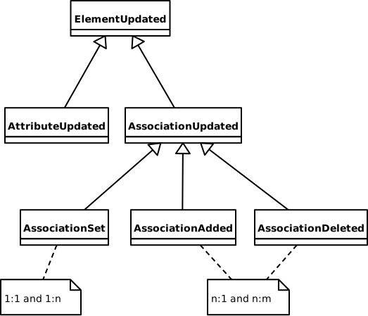
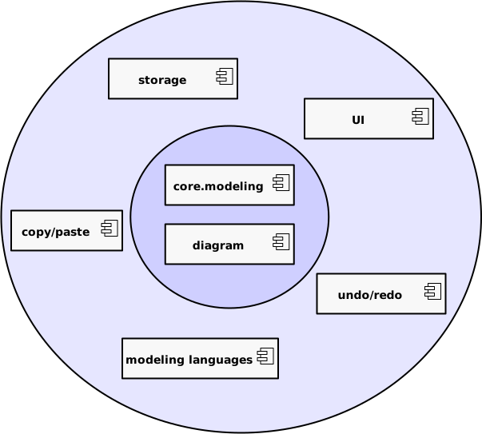

# Large GUI application with Python and GTK

Arjan Molenaar

Notes:

Hi I'm Arjan Molenaar and I am a software engineer working for Xebia in The
Netherlands. I've been involved in numerous projects ranging from financial
systems to embedded applications. I'm a long time GNOME user and core
contributor to a modeling tool called Gaphor.

---
## What are we looking for

- Accessible,
- Modular,
- Extensible code base

Notes:

What are we looking for in a large code base:

1. Easy to work with. Python is a dynamically typed language. Since the code base gets larger, and we want to
   be extensible, we need to do some extra work to help with coding.
2. modularity: this allows you to work on one part of the application without knowledge of other parts.
3. Extensibility follows from modularity. Once a code base is modular, it should be easy to add new functionality.

---
## The case: Gaphor



Notes:

The application I've been working on is Gaphor. It's a modeling tool, so you can draw diagrams and create models
in UML, SysML, or simply in the C4 modeling language.

I started this project in the early 2000's, when the promise of modeling was new and exciting. I was disappointed
with the tools I worked with (Rational Rose) and thought I can do better.

---
## GTK 101

<div style="column-count: 2">

- GTK is a GUI toolkit
- Used by GNOME, GIMP, Inkscape
- Central is `GObject`
   - Add OO support to C
   - Supports signal handlers



</div>

Notes:

This application is built with GTK. GTK is a cross platform GUI toolkit.

In GTK all widgets are based on GObject. Although GTK is written in C, GObject provides support for
classes and interfaces.

GObject also provides signals handling, so you can register a handler on an event that happens from
your object and handle it. For example a button press, or a property change.

---
## Python 101

- Dynamically typed language
- Multi-paradigm: functional, OO
- Good interoperability with C
- Used in many fields

Notes:

Python is used in many fields, ranging from data science to web services to Mars landers.

---

## Accessibility

- Python type annotations
- Package structure
- Composition over inheritance

Notes:

To make code more accessible we made some changes over the past years:

- introduced type annotations to helps us (and others) in coding (command completion in IDE's)
- The package layout has changed

---

### Programmer aid: typing (Mypy)

- Python is a dynamically typed language
- Type annotation avoid mistakes
- IDE's can help you with your code
- `typing.Protocol` for the win

```python
def function my_func(arg: str, other: SomeType):
   ...
```

Note:

Python is dynamically typed. That does not mean there are no types!
Types do exist. For example: a method call still requires that method to be defined
on that object. It's helpful in larger code bases to leave out the guess work and type
methods, especially at component boundries.

At first I was a bit skeptical adding type information to Python. But I found it to be a good addition,
for understandability (you do not have to look where a method is called to find out it's arguments) and
for IDE support.

Python also has a concept of protocols, so you do not need to inherit from interfaces all the time.
A protocol defines the methods that are expected on an object. This can be type checked, but no
inheritance is required, like with strong typed languages.

---
### Package structure

- Based on feature, not component type

<div style="column-count: 2">

```bash
gaphor/
   models/
   diagramitems/
   propertypages/
   copypaste/
```   

```bash
gaphor/             
   UML/
   SysML/
   C4model/
   core/
   ui/
   storage/
```
</div>

Notes:

Another important aspect is how you can relate to the application's functionality.

The layout on the right is easier to relate to the functionality of the application
than the structure on the left. The left is more a classic layered approach, where
each layer is presented by a package. The structure on the right represents the
functionality/features found in the application. If you know the UI, you can much
easier find your way.

---
### Composition over inheritance

- Inheritance is static
- Composition is dynamic
- Separation of concerns
- For widgets:
  - Easier to manage than inheriting from widgets
  - User interaction is often done via multiple widgets

Note:

In my opinion this is a classic one. Composition is a much more powerful concept that inheritance.
With inheritance relations are put in concrete, when you write the code. With composition you
can still mix and match.
With inheritance you need to know the inheritance tree to figure out the behavior of an object, 
with composition it's right in front of you.

This is especially true for GUI widgets. The GUI widget's main purpose is to be part of a UI.
Mostly the code that we create is about binding to the application logic.

This also dripples down to the user interaction. For example a dialog with a couple of input fields.
It's not the dialog's responsibility to validate the input fields. Nor is it the responsibility of the
input field itself. There should be some logic behind it that verifies what is valid input
(say checking a checkbox would require additional information to be filled in).

---
#### Composition over inheritance



Don't:


```python
class AppWindow(Gtk.ApplicationWindow):
    def __init__(self):
        super().__init__()

        self.label = Gtk.Label(label="label")
        self.add(self.label)

    def on_change_label_state(self, action, value):
        ...

    def on_maximize_toggle(self, action, value):
        ...
```

---
#### Composition over inheritance



Do:

```python
class AppWindow:

    def construct(self):
        self.window = Gtk.ApplicationWindow()

        self.label = Gtk.Label(label="label")
        self.window.add(self.label)
        ... # hook up signal handlers

    def on_change_label_state(self, action, value):
        ...

    def on_maximize_toggle(self, action, value):
        ...
```
---
## Modularity

- Services
- Event dispatching
- Generic functions / dynamic dispatch

Notes:

All code neatly organized in packages, that's only s start.

For code to be modular it also should allow to work on one part of the code
without knowing about other parts.

In Gaphor we achive this by using a service oriented approach. Services are
loosely coupled and communicate via event dispatching.

---
### Services

In Python, use `entry_points`.

Defined in `pyproject.toml`:

```toml
[tool.poetry.plugins."gaphor.services"]
"component_registry" = "gaphor.services.componentregistry:ComponentRegistry"
"event_manager" = "gaphor.core.eventmanager:EventManager"
"element_factory" = "gaphor.core.modeling:ElementFactory"
"undo_manager" = "gaphor.services.undomanager:UndoManager"
"modeling_language" = "gaphor.services.modelinglanguage:ModelingLanguageService"
"file_manager" = "gaphor.ui.filemanager:FileManager"
```

```python
class UndoManager(Service):

    def __init__(self, event_manager, element_factory):
        ...
```

Notes:

Services in Python can be made with entry_points. This is a standard Python feature.
All registered services (gaphor.services) can be loaded, irregardles of the
package they can be found in. This mechanism can therefore be used to implement
plugins for free.

---
## Event dispatching

<div style="column-count: 2">

- Decouple components
- Central event dispatcher service
- Listen on an event types



</div>

Notes:

Event dispatching is used in Gaphor extensively to decouple components.
Initially did dispatching on objects, like in GObject, but that does
did not work for this case. There are places where you're interested in
an event but do not have access to the source. Hence you can not register
a handler.

Events are created as a hierarchy (yes we used inheritance there), so
an element can register for a property change in the model or for a specific
change on a relation between two objects in the model. 

---
### Pure Python core

<div style="column-count: 2">

- "Hexagonal" architecture
- testable code base
- separation between application core and functionality



</div>

Notes:

The services mainly make up for the outer boundaries of the architecture.
Replaceable things like an undo system and file manager. The core is defined
by a couple of packages that define essental features of the application:
the base model classes and diagramming functionality.

---
### Generic functions

Multiple functions with the same name,<br>
dispatched based on the parameter type.

Logic can be added incrementally.

```python
@singledispatch
def copy(obj: object):
    ...

@copy.register
def copy_named_element(element: NamedElement):
    return element.id, copy_named_element(element)

@copy.register
def copy_transition(element: Transition):
    yield element.id, copy_named_element(element)
    if element.guard:
        yield from copy(element.guard)
```

Notes:

The second extensibility mechanism Gaphor uses, is Generic functions. 
This mechanism is complementary to services. It allows for extending the functionality of a service.

Python has such a functionallity in the standard library. The `copy` function will
behave differently, depending on the type of element parameter. This allows to
extend functionality of the copy service.

This mechanism can be used for different aspects of the application: text formatting,
editors, item connections, grouping.

---
# Take away

- Typing, even in a dynamic language is your friend
- Favor composition over inheritance
- Create a stable core and build features on that
- Use the strengts of the programming language and ecosystem

Notes:

Strive for an architecture with a small, library independant core.
Typing is your friend, even in a dynamic language.

---
# Questions?

@ajmolenaar / gaphor@gmail.com

Notes:
