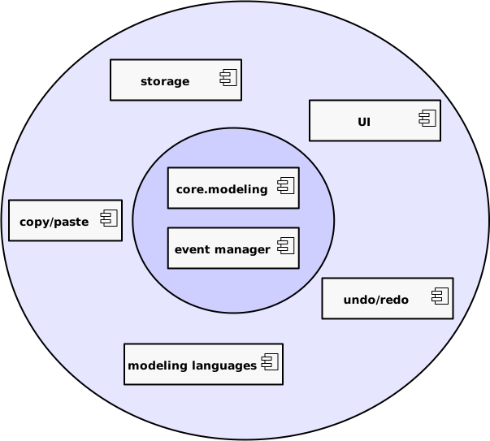

# Large GUI application with Python and GTK

Notes:

Hi I'm Arjan Molenaar and I am a software engineer working for Xebia in The
Netherlands. I've been involved in numerous projects ranging from financial
systems to embedded applications. I'm a long time GNOME user and core
contributor to a modeling tool called Gaphor.

---

# What are we looking for

- Modular
- Easy to work on
- Extensible code base

Notes:

What are we looking for in a large code base:

1. modularity: this allows you to work on one part of the application without knowledge of other parts.
2. Extensibility follows from modularity. Once a code base is modular, it should be easy to add new functionality
3. Easy to work with. Python is a dynamically typed language. Since the code base gets larger, and we want to
   be extensible, we need to do some extra work to help with coding.

---
# The case: Gaphor


Notes:

The application I've been working on is Gaphor. It's a modeling tool, so you can draw diagrams and create models
in UML, SysML, or simply in the C4 modeling language.

Something history...

---
# GTK 101

- GTK is a GUI toolkit
- central is `GObject`
   - add OO support to C
   - supports signal handlers

Notes:

This application is built with GTK. GTK is a cross platform GUI toolkit.

In GTK all widgets are based on GObject. Although GTK is written in C, GObject provides support for
classes and interfaces.

GObject also provides signals handling, so you can register a handler on an event that will happen from
GObject and handle it. For example a button press.

---

Large python: typing

- Python is a dynamically typed language
- Add type annotation to avoid mistakes

```python
def function my_func(arg: str, other: SomeType):
   ...
```

---

# Pure Python core

- "Hexagonal" architecture
- testable code base
- separation between application core and functionality

---

## Pure Python core

---

# Composition over inheritance

- Easier to manage than inheriting from widgets
- Separation of concerns
- User interaction is often done via multiple widgets

---

## Composition over inheritance

Don't:

```python
class AppWindow(Gtk.ApplicationWindow):
    def __init__(self, *args, **kwargs):
        super().__init__(*args, **kwargs)

        self.label = Gtk.Label(label=lbl_variant.get_string(), margin=30)
        self.add(self.label)
        self.label.show()

    def on_change_label_state(self, action, value):
        ...

    def on_maximize_toggle(self, action, value):
        ...
```

---

## Composition over inheritance

Do:

```python
class AppWindow:

    def construct(self):
        self.window = Gtk.Application()

        self.label = Gtk.Label(label=lbl_variant.get_string(), margin=30)
        self.window.add(self.label)
        self.label.show()

    def on_change_label_state(self, action, value):
        ...

    def on_maximize_toggle(self, action, value):
        ...

```
---

# Modularity

- Services
- generic functions / dynamic dispatch


---

## Services

In Python, use `entry_points`.

Defined in `pyproject.toml`:

```toml
[tool.poetry.plugins."gaphor.services"]
"component_registry" = "gaphor.services.componentregistry:ComponentRegistry"
"event_manager" = "gaphor.core.eventmanager:EventManager"
"element_factory" = "gaphor.core.modeling:ElementFactory"
"undo_manager" = "gaphor.services.undomanager:UndoManager"
"modeling_language" = "gaphor.services.modelinglanguage:ModelingLanguageService"
"file_manager" = "gaphor.ui.filemanager:FileManager"
```

---
## Generic functions

Multiple functions with the same name, dispatched based on the parameter type.

Logic can be added incrementally.

```python
@singledispatch
def copy(obj: object):
    # Default behavior
    raise ValueError(f"No copier for {obj}")

@copy.register
def _copy_named_element(element: NamedElement):
    return element.id, copy_named_element(element)
```
---

# Event dispatching

- Decouples components
- Central event dispatcher service
- Model is emiting events, everything should be able to listen
- Listen on an event type
  - Event hierarchy

---

!image event dispatching

---

# Take away

What are the take aways?