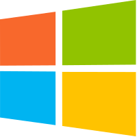
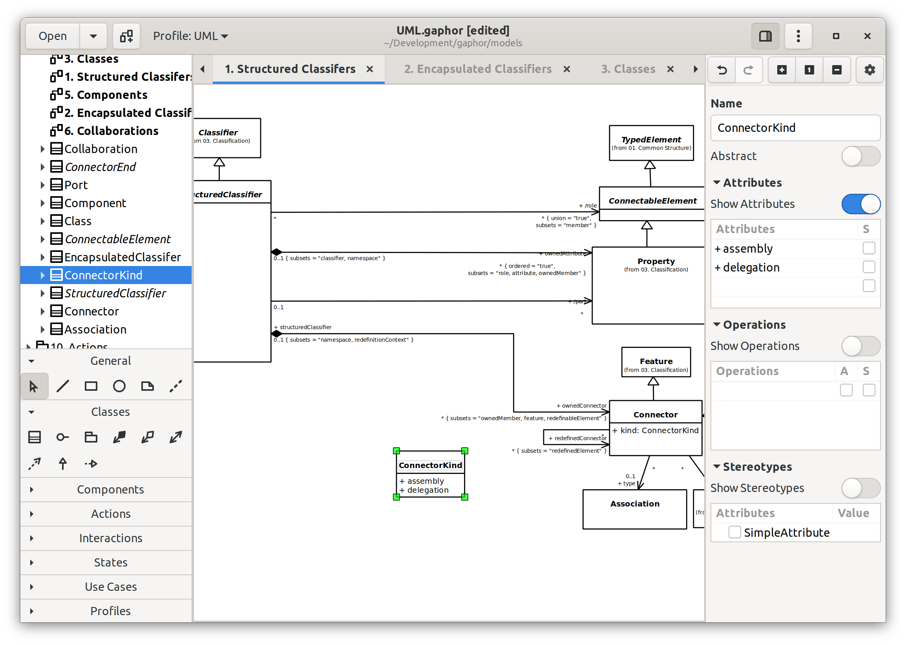

# Make Your Application Multi&#8209;Platform!

Linux App Summit 2021

Dan Yeaw &amp; Arjan Molenaar

Notes:

Hi I'm Arjan Molenaar and I am a software consultant working for Xebia in The
Netherlands. Next to work I like to code, (bi)cycle and brew beer.

Hi my name is Dan Yeaw. I work for Ford Motor Company in Michigan where I help
design safety in to complex software-based automated and electrified
technologies. In my free time, I have been working on an open source tool used
to model these complex system designs. That's how I got involved in contributing
with Arjan on Gaphor.

---

## What are we talking about

1. Why go multi-platform
1. The case: Gaphor
1. Building for Linux (Flatpak / AppImage)
1. Building for Windows
1. Building for macOS
1. Take aways

Notes:

* Who build software in their spare time?
* Desktop software?

1. Why go multi-platform (Arjan)
   - Community size is larger (platform user base and developer user base sizes)
1. What are we targetting (os, installation method, user type, automated) Arjan
   - Automatic as much as possible
   - No scary warnings during install
1. The case: Gaphor (Arjan)
1. Before you begin
   - Keep the toolset small (e.g. depend on GTK, but not on a whole lot of other libraries)
   - Avoid dependency hell
   - All dependencies need to be supported on all platforms
   - Use GTK out of the box as possible (avoid issues with GTK upgrades)
   - Keep true to the ecosystem (for Python, use pyproject.toml + a python build tool)
1. Building for Linux - Flatpak + AppImage (Dan)
   - Flatpak dependency install by building from the Python wheel
   - Separate repository in flathub
   - Differences between flatpak and appimage
   - AppImage requires build on older LIBC, challenges with not being able to use the latest GTK
1. Building for Windows (maybe switch order?) - Dan
   - Msys2 overview (familiar environment, presents challenges) - signing
   - Cooperate with upstream projects (PyInstaller)
1. Building for macOS - install script + PyInstaller - Arjan
   - Homebrew overview
   - macOS releases often break packaging - signing
   - library structure (macos libs use absolute references)
1. Take aways: Approach each platform separately. work with upstream projects. Consolidate

---

## A Vibrant Community

We want the apps we build to be useful for others!

- Users who get value out of using our app 👥
- Diverse contributors who want to help make it better 🔨

---

<!-- .slide: data-background="images/os_market_share.svg"  -->

---

## Why go multi-platform

1. Broader & more inclusive user base
1. Helps introduce people to Open Source
1. More future proof
1. Improves adaptability - not bound to a specific OS

Notes:

Most issues have been raised by Windows users.

---

## What are we targeting

* All major desktop platforms: Windows, macOS, Linux
* Automate as much as possible
* No scary warnings during install

Notes:
- automate -> build all in CI

---

## The case: Gaphor

Notes:

(Arjan)
* A modeling tool, written in Python (~ 44000 lines)
* GTK+ 3 (soon GTK 4)
* Why did I start this project almost 20 years ago: modeling should be
facilitating the creation process and help describe a system in components.

---
# Setup for Success

Notes:

(Dan)
About 4 years ago, When I started to get involved with Gaphor I was looking for
an open source modeling tool that I could use to model complex systems. I work
for Ford Motor Company, and in order to design say a car that can park itself,
we model how the behavior, structure, and requirements of the feature will work
safely for our customers.

I stumbled across Gaphor, and I was immediately blown away! It was a nice easy
to use modeling tool, and it was written in Python which since I'm not a
professional developer made it more approachable to dive right in.
Unfortunately, Arjan had been busy with other things in life and the project
hadn't been updated in 4 years.

---

## Painful Upgrades
- Highly customized widgets can be a nightmare
- Try to make out of the box solutions work

Notes:
(Dan)

10 years ago, Gaphor had a docking widget called etk.docking that created a
docking experience similar to IDEs like Eclipse have. This allowed you to
rearrange, hide, maximize and pop out the different UI components. This
required creating some very custom GUI widgets using GTK 2 and PyGTK. Although
it was clever, it would have had to have been completely rewritten as we moved
to GTK3, PyGObject, and Python 3. If you do come across a bug or an issue, it
is hard to get it fixed because you are exploring the limits of the GUI toolkit
with some edge case that no one else has likely seen before.

Here is a small example where we defined our own Compact Button. The class
inherits from a GTK Widget using PyGTK. These double underscore (or dunder)
definitions are class properties that we defined in order to create our own
object name, and custom signals and properties that are defined in Python
Dictionaries.

---

## Keep Things Simple
- Grab a great GUI toolkit
- Use out of the box widgets and other components
- Use a few key libraries if needed, ensure dependencies are well supported
  across platforms

Notes:

(Dan)
In the docking widget example we just saw, do users really need this much
customization in their UI components? Keeping things simple, consistent, and
aligned with the human interface guidelines is the way to go.

GTK and Qt already provide a great foundation to build a GUI application with.
In the same vane that you don't want to keep your GUI pretty simple, I would
also try to keep your toolset small and simple as well. Keep to a few other key
libraries or other dependencies if you can, and make sure that all of them are
well supported cross-platform.

Here we can see the dependencies of Gaphor:
- Python itself
- PyGObject which provides GTK and pycairo which provides canvas drawing
- gaphas and generic are our own libraries, gaphas is a diagramming library on
  top of pycairo to draw shapes and relationships between the shapes, and
  generic provides multi dispatch to dynamically dispatch a function or method
  based on its type.
- Finally we use tinycss2 for CSS support for theming of the app

---

## Stay True to the Ecosystem
- Follow the modern best practices for the language you are using
- These solutions will be tried and true
- For Python: pyproject.toml and a Python build tool

Notes:

(Dan)
This is one nice advantage of Python, batteries are already included and you
should have most of what you need already to build even very complex
applications.

There are tools like Cookiecutter that help you fully create a new project from
scratch using best practices like testing and packaging already setup.

For Gaphor, we use the more modern pyproject.toml to configure our project
instead of setup.py and we use Poetry for building the project in to a wheel
and uploading it to the Python Package Index, called PyPI. Other build tools
like pip-tools and flit are great as well.

In other words, setup your project based on the language you are using, and
then try to design the GUI that will conform to the GUI toolkit's interface
guidelines.

---

# Packaging

Notes:

(Dan)
Packaging your app so that it can be easily installed and run on each platform
is a very challenging problem. Each platform needs its own solution and next
we'll talk about some tips to be successful.

---

## Packaging in Linux with Flatpak

 - Flatpak is 😎
 - Provides universal and sanboxed distribution for Linux
 - For app developers, runtimes are a strong foundation to build on

Notes:

(Dan)
Flatpak and the distribution platform for them called flathub provides a great
way to distribute your app across Linux distributions. The format is great in
that it sandboxes the application, can be installed by non-root users, and it
is also has good desktop integration.

One of the killer features for an application developer is that it includes
maintained platforms called runtimes. These provide a strong foundation to
package your app on top of with all of the dependencies included.

---

## Building Flatpaks

 - Make builds reproducible by building from Python wheels
 - Uses a separate repository in flathub

Notes:

(Dan)
One of the challenges we faced with flatpak was getting a reliable build script
setup to work with our Python dependencies. Flatpak uses a manifest or recipe
in json or yaml format. Among other things, the manifest contains all of the
dependencies including the download location and a hash in the sha256 format.
This helps ensure that the flatpak build is reproducible, so that you get the
same result 

Although there is a flatpak builder tool for Python, it uses pip to re-resolve
all of the project dependencies, and it defaults to using source distributions
instead of using Python's wheel binary package format. We tried to use this for
a while, and even created and upstreamed a poetry builder tool, but everytime
we went to release a new version, something would break and we would have to
spend time troubleshooting. This is not what you want for your release process!
You want it to be simple, reliable, and automated.

To fix this, we ended up using a simple bash script to download the wheel of
the new version from PyPI with all of its dependencies, and then write the
download url and the sha256 to the manifest. Here you can see we use pip to
download the new version, ls and awk to get the list of files in two columns
using the dash as a separator to get the dependency name and filename. Then we
use curl and jq to connect to the PyPI endpoint and process the json to get the
filename and sha256. Although bash scripts are the solution to everything, in
this case it made our manifest generation simple and reliable.

A second challenge is that flathub uses a separate GitHub repository to build
all of the packages. While it is great that everything is setup to do the
automated builds and publish to flathub, it also adds some maintenance
complexity because now your packaging is split between two repos.

---

## AppImage: One app = one file
 - Another great format for distributing apps
 - Also universal and sandboxed with a single file executable
 - Challenges for app developers to use the latest GUI toolkits while
   maintaining compatibility for users 

Notes:

(Dan)
After we had been supporting flatpak for a while, we got a request from one
of our users to support AppImage packages as well. I was familiar with this
format as a user, they are really nice to be able to download a single file
and then run it with no installation required. We agreed that this would be
nice alternative to support.

One thing I learned while packaging our app for AppImage was that because
there was no external dependencies, that also means for the developer you
can't rely on a runtime being available. This creates some tension, because
I would like my app to be using the latest version of Python, GUI toolkit,
and other dependencies - this is open source, I want to develop on the latest
and greatest because that keeps things more fun and modern, as well as
more secure.

Unfortunately, things like glibc aren't backwards compatible, so you should
really build your app on an older distribution to maximize compatibility.  For
example, the oldest supported version of Cent OS or Ubuntu LTS are commonly
used at this time to build AppImages, but they ship with GTK versions that are
3 to 5 years out of date. There are tools to help with this or you can spin up
your own docker container with the right dependencies. This isn't
straightforward so right now our AppImages only work on the latest LTS version
or newer. Maybe one day we'll make Gaphor's AppImages more compatible.

---

## Windows

 - MSYS2 provides a familiar environment, but also some challenges
 - Cooperate with upstream projects to help improve things
 - Code signing

Notes:

(Dan)
MSYS2 provides an environment for building, installing, and running
applications in Windows. The bash command prompt also feels right at home if
you are comfortable with Linux. It also is the recommended way to run a GTK app
in Windows. Once we got Gaphor running in Windows, we used PyInstaller to
bundle it with all the needed dependencies.

However, this wasn't all smooth sailing. Python in MSYS2 has close to 100
different patches to get it to compile against Mingw-w64 GCC instead of the
normal Microsoft Visual C++ that Python is normally compiled against in
Windows. Since MSYS2 is a niche environment, Python and most of the libraries
aren't tested against it, and it is common for things to break. 

We were able to get pull requests merged with upstream projects like
virtualenv, PyInstaller, and poetry to fix bugs and improve compatibility.
Although this yak shaving isn't directly making our app better, it does improve
the overall ecosystem for others to use. I am hoping we can eventually help get
some of the patches to Python itself pushed uptream as well.

After feedback from our users, we did also implement code signing in Windows to
help reduce the scary warning messages that appear when you go to install an
app downloaded from the internet. This does involve paying a couple hundred
dollars a year on a code signing certificate and was a foreign experience for
us, but it was pretty easy to integrate in to our Continuous Integration build
process.

Here you can see the signtool app that comes with the Windows SDK signs the
application using the certificate, a timestamp server, the file and timestamp
digest algorithms are used with sha256.

---

## macOS

 - Homebrew
 - Signing

Notes:

* Homebrew started like BSD ports
* Signing requires an Apple Developer subscription

---
## macOS packaging

- A `.app` file in a DMG (disk image)
- Apps have a predefined directory structure
  
- Library references are absolute - need relocating
- Update environment variables
- Used our own script, now rely on _PyInstaller_

Notes:

(Arjan)
Env vars for shared files (Font config, GI, XDG, GDK-PixBuf)
macOS releases often break packaging

py2app is an alternative.

## macOS Signing

- Both app and dmg need signing
- All performed from buid pipeline

Notes:

---

## Take aways

* Approach each platform separately
* Work with upstream projects
* Integrate platform builds in the build pipeline

Notes:

---

# Questions?

Dan: @danyeaw / dan@yeaw.me

Arjan: @ajmolenaar / gaphor@gmail.com

Notes:

---

## Random thoughts

Things we may or not may want to discuss in this talk.

1. Build your CI around those platforms (GitHub is your friend here)
    - Check your packaged builds continuously
1. Costs for registering (windows) and notarizing (macos) your app vs benefits
1. Looking forward to the future
    - GTK4
1. war stories
