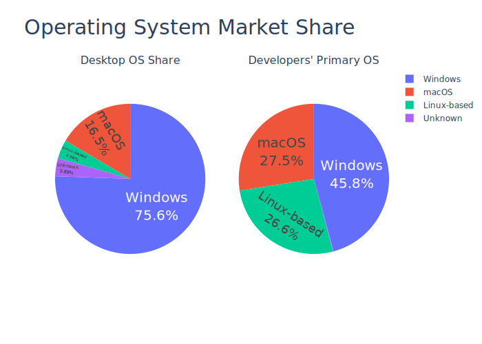

# Make Your Application Multi&#8209;Platform!

Linux App Summit 2021

Dan Yeaw &amp; Arjan Molenaar

Notes:

Hi I'm Arjan Molenaar and I am a software consultant working for Xebia in The
Netherlands. Next to work I like to code, (bi)cycle and brew beer.

Hi my name is Dan Yeaw. I work for Ford Motor Company in Michigan where I help
design safety in to complex software-based automated and electrified
technologies. In my free time, I have been working on an open source tool used
to model these complex system designs. That's how I got involved in contributing
with Arjan on Gaphor.

---

## What are we talking about

1. Why go multi-platform
1. The case: Gaphor
1. Building for Linux - Flatpak + AppImage
1. Building for Windows
1. Building for macOS
1. Take aways

Notes:
1. Why go multi-platform (Arjan)
   - Community size is larger (platform user base and developer user base sizes)
1. What are we targetting (os, installation method, user type, automated) Arjan
   - Automatic as much as possible
   - No scary warnings during install
1. The case: Gaphor (Arjan)
1. Before you begin
   - Keep the toolset small (e.g. depend on GTK, but not on a whole lot of other libraries)
   - Avoid dependency hell
   - All dependencies need to be supported on all platforms
   - Use GTK out of the box as possible (avoid issues with GTK upgrades)
   - Keep true to the ecosystem (for Python, use pyproject.toml + a python build tool)
1. Building for Linux - Flatpak + AppImage (Dan)
   - Flatpak dependency install by building from the Python wheel
   - Separate repository in flathub
   - Differences between flatpak and appimage
   - AppImage requires build on older LIBC, challenges with not being able to use the latest GTK
1. Building for Windows (maybe switch order?) - Dan
   - Msys2 overview (familiar environment, presents challenges) - signing
   - Cooperate with upstream projects (PyInstaller)
1. Building for macOS - install script + PyInstaller - Arjan
   - Homebrew overview
   - macOS releases often break packaging - signing
   - library structure (macos libs use absolute references)
1. Take aways: Approach each platform separately. work with upstream projects. Consolidate

---

## Why go multi-platform

<small>Source: https://insights.stackoverflow.com/survey/2020</small>
<small>Source: https://gs.statcounter.com/os-market-share/desktop/</small>

---

## Why go multi-platform

1. Broader user base
1. Feels more future proof (dog fooding / using at work)
1. Easier adoption - not bound to a specific OS
1. Reaches people unfamiliar with Open Source

Notes:

Most issues have been raised by Windows users.

---

## What are we targeting

* All major desktop platforms: Windows, macOS, Linux
* Automate as much as possible
* No scary warnings during install

Notes:
- automate -> build all in CI

---

## The case: Gaphor

Notes:

(Arjan)
* A modeling tool, written in Python (~ 44000 lines)
* GTK+ 3 (soon GTK 4)
* why did I start this project almost 2 years ago: modeling should be
facilitating the creation process and help describe a system in components.

---
## Before you begin

Notes:

(Dan)
 - Keep the toolset small (e.g. depend on GTK, but not on a whole lot of other libraries)
 - Avoid dependency hell
 - All dependencies need to be supported on all platforms
 - Use GTK out of the box as possible (avoid issues with GTK upgrades)
 - Keep true to the ecosystem (for Python, use pyproject.toml + a python build tool)

---

## Linux

 - Flatpak + AppImage (Dan)
 - Flatpak dependency install by building from the Python wheel
 - Separate repository in flathub
 - Differences between flatpak and appimage
 - AppImage requires build on older LIBC, challenges with not being able to use the latest GTK

---

## Windows

 - Msys2 overview (familiar environment, presents challenges) - signing
 - Cooperate with upstream projects (PyInstaller)

---

## macOS

 - install script + PyInstaller - Arjan
 - Homebrew overview
 - macOS releases often break packaging - signing
 - library structure (macos libs use absolute references)

---

## Take aways

* Approach each platform separately
* Work with upstream projects
* Integrate platform builds in the build pipeline

---

# Questions?

Dan: @danyeaw / dan@yeaw.me

Arjan: @ajmolenaar / gaphor@gmail.com

---

## Random thoughts

Things we may or not may want to discuss in this talk.

1. Keep the toolset small (e.g. depend on GTK, but not on a whole lot of other libraries)
    - Avoid dependency hell
    - All dependencies need to be supported on all platforms
    - Use GTK out of the box as possible (avoid issues with GTK upgrades)
2. Keep true to the ecosystem (for Python, use pyproject.toml + a python build tool)
3. Work with upstream projects (in our case PyInstaller)
4. Build your CI around those platforms (GitHub is your friend here)
    - Check your packaged builds continuously
5. Costs for registering (windows) and notarizing (macos) your app vs benefits
6. Looking forward to the future
    - GTK4

- war stories
