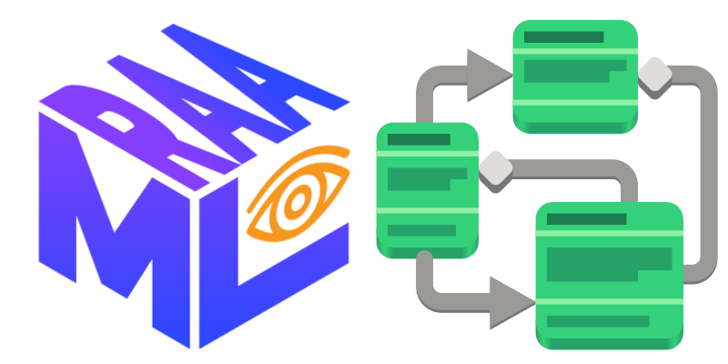

# Open STPA with RAAML and Gaphor

2021 STAMP Workshop

Dan Yeaw &amp; Kyle Post

Notes:

Hi my name is Dan Yeaw. I work for Ford Motor Company in Michigan where I help
design safety in to complex software-based automated and electrified
technologies. In my free time, I have been working on an open source tool used
to model these complex system designs. That's how I got involved in contributing
with Gaphor. I also like to ride bicycles!

Hi I'm Kyle Post 

---

## A Vibrant Community

We want to build an open community for systems safety

- A low barrier to join, learn, and grow 👥
- Diverse contributors who want to help 🔨
- We are building this community on open standards and open source software

Notes:

---

## Safety Standards

- Each industry has developed domain specific standards, most derived fom IEC 61508
- New techniques, like STPA, can improve how we do safety analysis
- Fundamentally lack rigor without a standardized language and automation.

---

## RAAML

- The Risk Analysis and Assessment Modeling Language standardizes a language for systems safety
- OMG beta standard, final release later this year
- A rigorous and standardized language allows us to describe system safety designs with precision
- Includes support for STPA based on the STPA Handbook

---

## Gaphor

- An open source modeling tool written in Python
- 20+ years old, recently modernized with support for SysML and RAAML added
- Fast and easy to use, while still having a full data model
- Improves rigor through automation, highly repeatable, adheres to standards

---

# Demo

---

For more information see:

https://omg.org/spec/RAAML

https://gaphor.org

@danyeaw

