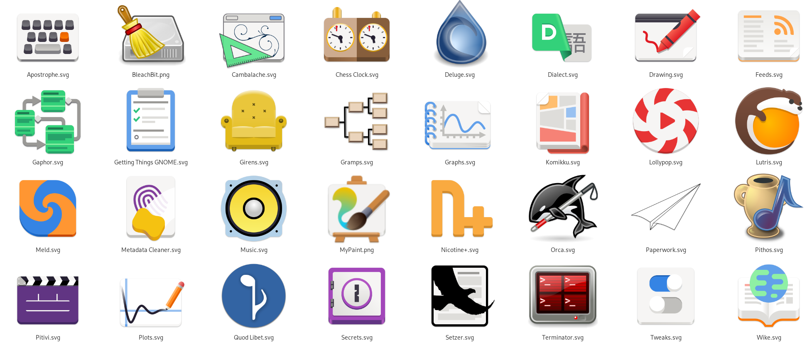
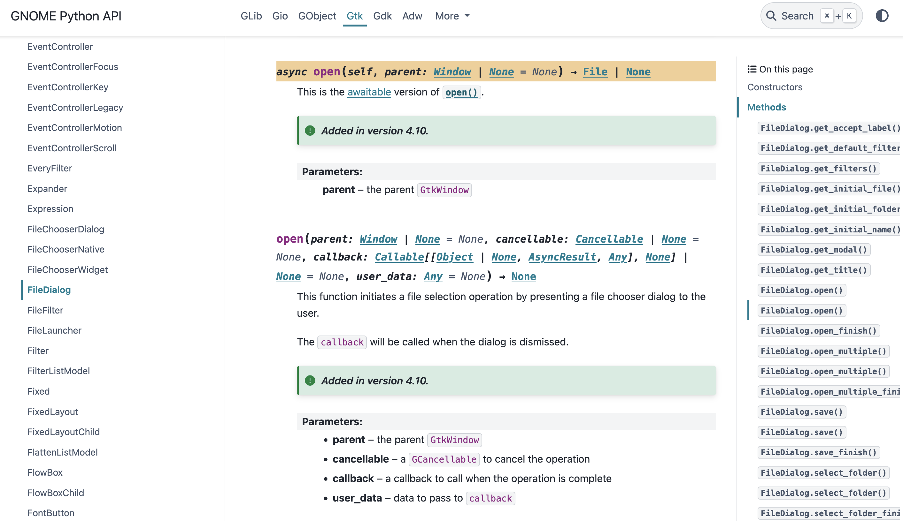

% The State of Python in GNOME
% Dan Yeaw (@danyeaw:gnome.org), Arjan Molenaar (@amolenaar:gnome.org)
% July 24, 2025 - Creative Commons Attribution-Noncommercial (CC BY-NC)


## About Us

::: columns

:::: column
Arjan Molenaar

{ height=45% }

- From The Netherlands
- PyGObject and Gaphor
- GTK on macOS

::::

:::: column
Dan Yeaw (pronounced: Yaw)

{ height=45% }

- From California, now Michigan
- PyGObject and Gaphor
- Gvsbuild

::::

:::

::: notes

Hi, I'm Dan Yeaw and I'm Arjan Molenaar, and we are sooo excited to talk to you
about Showing up for Python in GNOME!!

We have been helping to maintain PyGObject and have been GNOME Foundation members
for the last couple years.

Arjan:
I'm a software consultant by day, open source hacker by night. Live in The Netherlands.
Since roughly a year I've been maintaining PyGObject. Apart from that I try to improve
the support for GTK on macOS.

Dan:
As Engineering Manager for Open Source Software at Anaconda, I lead teams
working on projects including BeeWare, PyScript, Jupyter, and fsspec. Over the
past seven years, I've been actively contributing to open source projects while
building the Michigan Python community as a leader and organizer.

We also help maintain a Python GTK app called Gaphor which is a GNOME Circle
app for doing SysML and UML modeling. I also help maintain Gvsbuild which is
a build system for GTK on Windows.

:::

## GNOME Python

PyGObject is the GTK and related library bindings for Python

{height=65%}

::: notes

Dan: PyGObject is Python in GNOME. It is the successor to PyGTK that James
Henstridge started in 1998 that uses the girepository library to allow you to
build GNOME apps using Python. If you see the patterns in the app icons here,
those deep interests that people geek out on includes drawing and art, modeling,
graphing, music, genealogy, manga, classic gaming, and scientific reports.

:::

## GNOME 49 with Showtime

```{=latex}
\begin{center}
```

{ height=80% }

```{=latex}
\end{center}
```

::: notes

Dan: When GNOME 49 is released in September, it will include a new default video
app called Video Player (with the codenamed Showtime). This is an example of the
type of app that really shines using Python.

:::

# What's New in GNOME Python

## Improvements to AsyncIO support

It's easier to start using `asyncio`:

```python
asyncio.set_event_loop_policy(GLibEventLoopPolicy())
app = Adw.Application(...)
app.run()
```
vs.

```python
app = Adw.Application(...)
with gi.events.GLibEventLoopPolicy():
    app.run()
```

Kudos to Benjamin Berg

::: notes
TODO: Should we add a before and after?

We've implemented asyncio support in Gaphor, our other project, as soon as it
was available. And we're sooo happy. It makes the code so much simpler. Just not having to
deal with all those callbacks is totally worth it.

The credits for this feeature as all for Benjamin, as he did all the heavy lifting.

We added the feature as an experimental feature in 3.50. In 3.52 a few convenience API's were added.

Unfortunately we have to revisit parts of the code: some features we currently rely on will be removed
in Python 3.16 and produce deprecation warnings with Python 3.14.
:::

## Enhanced documentation and examples

::: columns

:::: column
* The documentation is built using PyGObject
* API docs are focused on GNOME core libs
* Recently added docs for async methods
::::

:::: column
{height=65%}

https://api.pygobject.gnome.org
::::

:::

::: notes
Dan: Last year we centralized most of the docs, this year we improved that by
making the API docs more official at https://api.pygobject.gnome.org.
We also recently added asynchronous method documentation, and now our documentation
is on par with the functionality GObject provides.
:::

## Migration to girepository 2.0

* Improved the code base

* Unfortunate fallout: apps not able to upgrade due to dependency on gobject-introspection

::: notes
Arjan: This is kind of the elephant in the room. With PyGObject 3.52 we moved from gobject-introspection
to girepository as the underlaying library for introspection bindings.

Although girepository had a positive effect on the code, it turned out that a number of applications,
especially the ones that depend on libpeas or directly depend on gobject-introspection.

I was not aware of the blast radius of this change and we should have probably did a major version
change of PyGObject with the upgrade.

I believe it's better for the upcoming GNOME release. Emanualle Bassi has a talk on how we can prevent
those issues from happening in the future.
:::

## What's Next in GNOME Python

* PyGObject is mature

* Remove deprecated bits

* Take advantage of new Python features
  * Free threading Python
  * Changes in `asyncio`

* Better type support

::: notes
Arjan: PyGObject has been stable and used for years. That's not going to change.

The focus will be on bringing PyGObject into the future.
This means removing deprecated code, and adding support for new Python features.

One of those is "free-threaded" Python. Historically Python had one big Global Interpreter Lock,
the GIL that made sure only one thread was executing code in a Python interpreter. With
"Free-threaded" Python, the locks are more fine grained. However, it only works if all libraries
also support this.

Recent changes in the `asyncio` module will have us reconsider how we implement this in PyGObject,
as it will not work from Python 3.16 and onwards.

Type support for PyGObject has been a thing for years. `PyGObject-stubs` surves that purpose quite
well, but it would be nice if we can add support to static type checkers such as MyPy.

Something I've been thinking about is a small tool that serves as a documentation generator for
all your locally installed libraries. Since you may be working on an application that requires
more libraries than just the ones documented on the api docs website.
:::

## Adding Python Examples to docs

* Added examples to GtkSourceView
* Not yet generated by API Docs

```C
GtkTextTagTable *tag_table;
GtkTextTag *tag;
tag_table = gtk_text_buffer_get_tag_table (buffer);
tag = gtk_text_tag_table_lookup (tag_table,
                                 "gtksourceview:ctx-classes:string"
                                 );
```

```python
buffer = GtkSource.Buffer()
tag_table = buffer.get_tag_table()
tag = tag_table.lookup(name="gtksourceview:ctx-classes:string")
```

::: notes
Dan: At the version of this talk last year, someone in the Q&A asked about Python examples in
the docs. It can be hard to get started using PyGObject, because in the API docs, the examples
are in C code and many users aren't familiar enough with the syntax to translate an equivalent
back to Python. Christian Hergert responded that nothing is stopping us from putting Python
examples inline in the libraries, so as an experiment I contributed Python examples to
GtkSourceView. However, these examples aren't yet being generated by our API docs, and that
could be a something we try out soon.

:::

## Make development environment setup easier

- Especially on Windows, a dev environment is difficult
- Distributing compiled binaries through conda or wheels could make this much easier

::: notes

Dan: Right now, to build a PyGObject project you have to have GTK and friends installed. This
experience is usually pretty ok on Linux, because the dependencies can be installed with
your distribution's package manager. On Windows this is especially difficult, you need to
use MSYS2 or Gvsbuild to install all the dependencies which isn't a typical development
workflow. Conda solves this by distributing all the dependencies as packages and
is cross platform. We could also build "fat wheels", which are Python binaries including
the dynamic dependencies.

Maybe we could add a conda and wheel image?

:::

## Call to Action

https://gitlab.gnome.org/GNOME/pygobject

- Contributions of any kind will help continue to help the community thrive
- Submit and help triage issues
- Continue to help us improve the docs
- Help us fix bugs and implement features
- Add examples to Workbench
- Build projects with PyGObject
- Blog and create videos

::: notes
Dan: Many of you have even more ideas on what we could improve next, and we
would love to have your contributions!

:::

## Wrap Up

Thank you so much to everyone who has contributed to PyGObject!

Slides:
https://github.com/gaphor/presentations/tree/main/state-of-python-in-gnome-2025

Matrix Chat with us at #python:gnome.org

::: notes

:::

# Questions?
